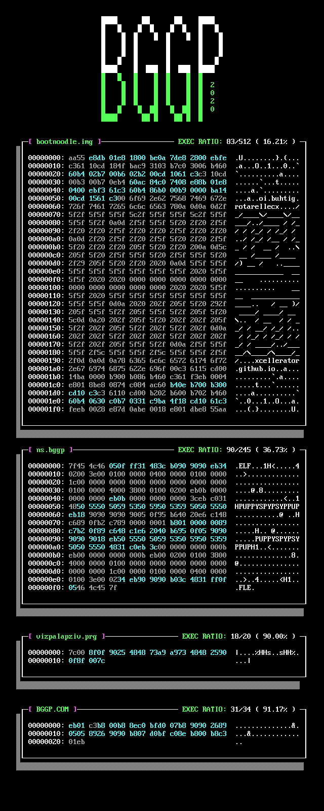

# BGGP 2020

This was the first annual Binary Golf Grand Prix, which took place June 22nd - August 28th 2020. The goal was to create a binary that executed the same backwards as it did forwards. See https://n0.lol/bggp/ for more details!

The entries were as follows:

| File | Author | Description | Size (Bytes) | Execution Ratio | Writeup |
|------|--------|------------|------|-----------------|---------|
| bootnoodle.img | [xcellerator](https://twitter.com/TheXcellerator) | x86 Bootloader | 512 | 83 bytes out of 512 (16.21%) | https://xcellerator.github.io/posts/bggp/
| ns.bggp | [netspooky](https://twitter.com/netspooky) | 64 bit ELF | 245 | 90 out of 245 (36.73%) | https://n0.lol/bggp/writeup.html |
| vizpalapziv.prg | [viznut](https://twitter.com/viznut) | Commodore VIC-20 PRG | 20 | 18 out of 20 (90%) | http://viznut.fi/demos/vic20/vizpalapziv.html |
| BGGP.COM (Winner) | Boo Khan Ming | DOS COM File | 34 | 31 out of 34 (91.17%) | See folder |

A video walk through of the entries is here: https://youtu.be/s0TS2kZtcGk

See each folder for source and additional notes.

