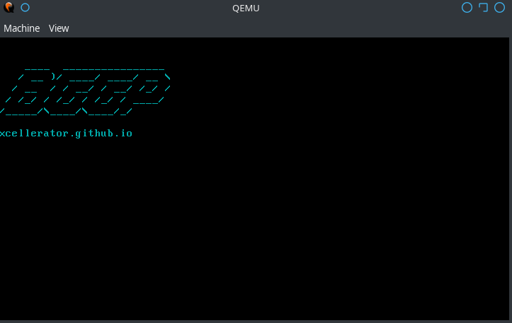

# BootNoodle
## A Palindromic Bootloader for [BGGP](https://n0.lol/bggp/)

So named because the execution flow jumps around between reversed and non-reversed op codes in a noodly-tangle.

Please find a write-up of how I built this bootloader here: [xcellerator.github.io](https://xcellerator.github.io/posts/bggp/)

### Submission

Binary: [bin/bootnoodle.bin](bin/bootnoodle.bin)

Source: [src/bootnoodle.asm](src/bootnoodle.asm)

### Build Instructions

* Run [build.sh](build.sh) after cloning
* Check sums below with [sums.sh](sums.sh)
* Run with `qemu-system-x86_64 bin/bootnoodle.bin`

### SHA256 Sums

* Forward:	`afd35223493930d7ea455b2352627783bfd53ddc54789cc3d81137da1ec3ac51`
* Backward:	`afd35223493930d7ea455b2352627783bfd53ddc54789cc3d81137da1ec3ac51`
