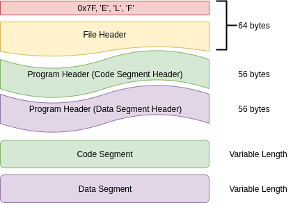

# BGGP2021
Entry submission for Binary Golf Grand Prix 2021

### ELF64 binary format explained



### Polyglot files

`b.pdf` (can be opened by Adobe Acrobat Reader, Firefox or Google Chrome web browser only)
(It is shown as blank page on Linux Debian/Ubuntu Document viewer)

This 275-byte `b.pdf` file (with Unix linebreak 0xA) is embedded as part of ELF64 binary program in data segment. It does not overlap with executable code, much easier.

### Polyglot explained

**Updated on 12 Aug 2021**

Surprisingly, after I compile this `bggp2021.asm` to `bggp2021`, it is identified as both executable and PDF file.

If renaming it with `.pdf` extension, and enabling "Execute" permission, ewww, it can be opened by PDF reader (Firefox, Chrome, Adobe Reader) and run in terminal window:

```
boo@boo-K40IN:~/fasm$ ./bggp2021.pdf
2
```

Here's why. *Ange Albertini* wrote:

"The PDF format officially requires its %PDF-1.x signature to be at offset 0x00, but in practice most interpreters only require its presence within the first 1,024 bytes of the files."

### Executable code

This BGGP2021 binary program will print "2" on screen and return with exit code 0x2.

```
	mov	edi,2
	mov	eax,60		; sys_exit
	syscall
```

### Conclusion

Thanks to @netspooky for the 2nd consecutive year of wonderful binary challenge!
